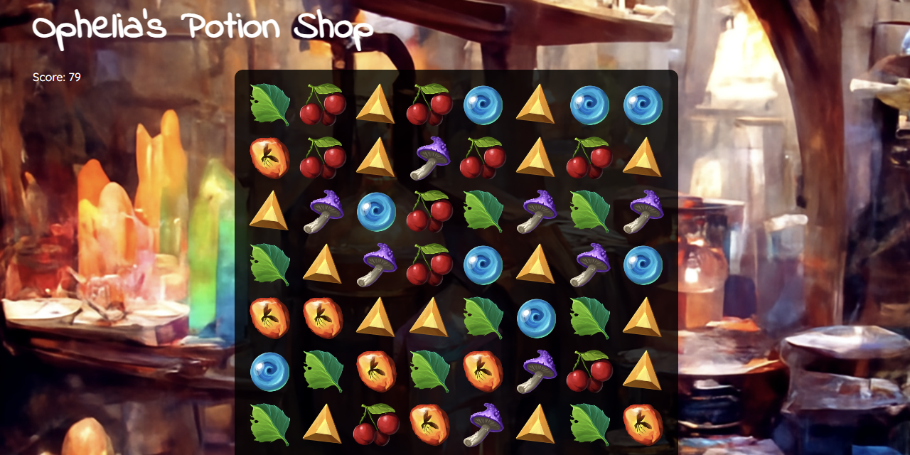

# Workshop: Create a Match 3 Game



## About the Project

Something _like_ https://en.wikipedia.org/wiki/Bejeweled

8x8 grid composed of multi-value tiles

actions:
- click on two adjacent tiles to swap
- swap horizontal neighbors
- swap vertical neighbors
- can only swap if the result makes a match

goals:
- make connecting lines (horizontal or vertical) of 3 or more matching tiles

mutations:
- matches disappear
- tiles "fall" to fill gaps
- new tiles fill from the top to fill up the grid

lose condition:
- can make no further moves

score:
- score increases for:
    - each match made
    - each match composed of more than 3 items

milestones:
- [x] board displays
- [x] can swap tiles
- [x] matches are detected
- [x] matches are removed
- [x] board falls into gaps
- [x] board fills in top
- [ ] lose condition checked
- [x] points
- [ ] bonus items?

what do you call a match?
* is it just a line of 3 adjacent items?
* or is it a grouping of items where at least 3 of them are in an adjacent line?


## Project Setup
```
yarn install
```

### Compiles and hot-reloads for development
```
yarn serve
```

### Compiles and minifies for production
```
yarn build
```

### Lints and fixes files
```
yarn lint
```

### Customize configuration
See [Configuration Reference](https://cli.vuejs.org/config/).
